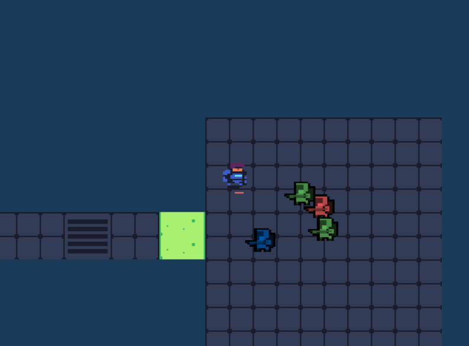

# (TODO: your game's title)

Author: (TODO: your name)

Design: (TODO: In two sentences or fewer, describe what is new and interesting about your game.)

Screen Shot:

How To Play:

(TODO: describe the controls and (if needed) goals/strategy.)

Sources: (TODO: list a source URL for any assets you did not create yourself. Make sure you have a license for the asset.)

Tech Dungeon asset pack
https://trevor-pupkin.itch.io/tech-dungeon-roguelite

Outer Buddies asset pack
https://trevor-pupkin.itch.io/outer-buddies

Images:
https://upload.wikimedia.org/wikipedia/commons/c/cd/Green_Tree_Frog_0277.jpg
https://media.istockphoto.com/photos/rubber-duck-picture-id164922078?k=20&m=164922078&s=612x612&w=0&h=e_lokW6W3qzRvMCyNELflspJeFGQ37rm5Xd_PXwtYf4=
https://visualpharm.com/assets/858/Dice-595b40b65ba036ed117d43b8.svg
https://icons8.com/
https://image.shutterstock.com/image-vector/thermal-grease-260nw-532484707.jpg

This game was built with [NEST](NEST.md).
